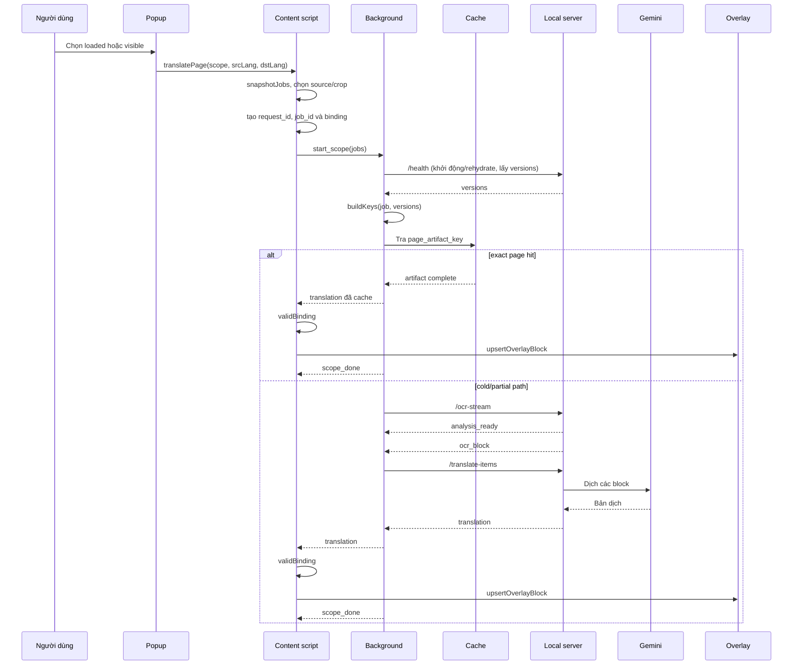
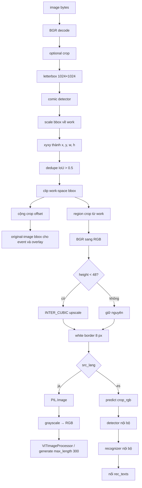

# Workflow MangaTranslator — từ ảnh manga đến overlay

## 1. Đọc nhanh trong hai phút

Người dùng chọn **Dịch ảnh đã tải** hoặc **Dịch phần đang thấy** trong popup. Content script chụp các `` đủ điều kiện, gửi các job qua service worker. Service worker tạo key, tra session cache và chỉ chạy OCR/dịch cho phần chưa có artifact hoàn chỉnh. Kết quả hợp lệ quay về content script để đặt overlay đúng ảnh, đúng nguồn và đúng ngôn ngữ.



## 2. Thành phần và dữ liệu chính

| Thuật ngữ | Vai trò |
| --- | --- |
| popup | Giao diện chọn phạm vi và ngôn ngữ, gửi lệnh dịch cho tab đang mở. |
| content script | Đọc DOM ảnh, tạo job, giữ binding và dựng overlay. |
| background/service worker | Điều phối request, cache, producer và các tác vụ OCR/dịch. |
| local server | API cục bộ phục vụ OCR streaming và dịch theo block. |
| detector | Bước phân tích tìm vùng chữ; kết quả báo qua `analysis_ready`. |
| recognizer | Bước OCR biến vùng chữ thành `ocr_block` với văn bản nguồn. |
| overlay | Lớp DOM tuyệt đối hiển thị bản dịch trên ảnh. |
| request | Một lần `start_scope`, có `request_id`, scope và tập job. |
| job | Một ảnh/crop cụ thể thuộc request, có `job_id`. |
| producer | Công việc dùng chung theo artifact key, có thể phục vụ nhiều consumer. |
| consumer | Liên kết một producer với một `request_id` và `job_id` cần nhận kết quả. |
| region | Vùng chữ được detector xác định trước OCR. |
| block | Đơn vị OCR/dịch gồm `block_id`, bbox, văn bản nguồn và bản dịch. |
| artifact | Bản ghi cache cho trạng thái/phân tích/OCR/overlay của một job. |

## 3. Chọn ảnh và nguồn ảnh

`selectCandidates(images, scope, viewportWidth, viewportHeight)` hiện chỉ xét thẻ ``. Canvas không thuộc pipeline hiện tại.

| Quy tắc | `visible` | `loaded` |
| --- | --- | --- |
| Eligibility chung | `img.complete`, có source, `naturalWidth` và `naturalHeight` đều ≥ `400` (tối thiểu `400×400`) | `img.complete`, có source, `naturalWidth` và `naturalHeight` đều ≥ `400` (tối thiểu `400×400`) |
| Tập ảnh | Chỉ ảnh giao với viewport | Mọi ảnh eligible đã tải |
| Source | `currentSrc || src` | `bestSource()` |
| Crop | Crop viewport đã normalize | Toàn bộ ảnh (`full`) |

`bestSource()` ưu tiên ứng viên `srcset` có descriptor lớn nhất phù hợp, nhằm giữ độ phân giải OCR. `visible` cố ý dùng nguồn đang render (`currentSrc || src`) để crop khớp chính xác ảnh trên màn hình.

## 4. Viewport crop và hệ tọa độ

Với `visible`, `viewportCrop()` lấy phần ảnh giao viewport, thêm padding 10% theo chiều rộng và cao phần giao, rồi normalize về khoảng 0–1. Crop phủ toàn ảnh được chuẩn hoá thành `full`.

Khi đổi crop normalized sang pixel của ảnh nguồn:

```text
offset_x = floor(left × image_width)
offset_y = floor(top × image_height)
right_px = ceil(right × image_width)
bottom_px = ceil(bottom × image_height)
```

Ba hệ tọa độ không thay thế cho nhau: bbox detector tạm thời là **work/crop-space** và dùng để cắt region. `Pipeline.analyze()` cộng offset để tạo **original-image bbox**; đây là bbox công khai phát trong `ocr_block`. Cuối cùng overlay scale original-image bbox sang **CSS coordinates** theo kích thước ảnh đã render (`renderedImageRect`), không dùng trực tiếp pixel work/crop cho CSS.

## 5. Tạo key và xếp lịch job

`buildKeys(job, versions)` loại fragment khỏi URL và canonicalize crop trước khi hash. Các thành phần key là:

| Key | Thành phần |
| --- | --- |
| `sourceRevision` | URL nguồn không fragment, `natural_width`, `natural_height` |
| `analysis_key` | `sourceRevision`, crop, phiên bản detector/dedupe/prep |
| `ocr_key` | `analysis_key`, `src_lang`, phiên bản recognizer của ngôn ngữ nguồn |
| `overlay_key` | `sourceRevision`, crop, `ocr_key`, `dst_lang`, phiên bản model/prompt/policy dịch |
| `page_artifact_key` | `overlay_key`, phiên bản page schema |

Producer được gom theo `page_artifact_key`; consumer giữ cặp request/job để cùng một tiến trình có thể phát kết quả cho nhiều nơi. Với `visible`, cache page được dùng để khôi phục artifact hoàn chỉnh hoặc tái sử dụng phần analysis/OCR; `loaded` không đọc page artifact trước khi tạo producer.

Scheduler dùng `MAX_CONCURRENT = 2` producer chạy đồng thời và `MAX_OUTSTANDING_PER_REQUEST = 4` job outstanding cho mỗi request. Ưu tiên là foreground `0`, background `1`, prewarm `2`: số nhỏ hơn chạy trước.

## 6. Detector xử lý ảnh thế nào



`Pipeline.analyze()` nhận bytes ảnh và `crop` normalized. `_decode_crop()` decode bằng OpenCV thành ảnh BGR; nếu có crop, nó cắt ra `work` và giữ `offset_x`, `offset_y` để sau này quay về ảnh gốc. `analysis_key` tra cache phân tích trước; cache này chứa tối đa 32 artifact, tổng tối đa 128 MiB.

`Detector.detect(work)` đưa BGR `work` vào comic text detector. Vendor đổi BGR sang RGB, letterbox giữ tỉ lệ về input mặc định `1024×1024`, rồi scale output trở lại kích thước `work`. Mỗi box `xyxy` được đổi thành `TextRegion(bbox=(x, y, w, h), vertical=...)`. Khởi tạo CUDA lỗi thì `Detector` tạo lại model trên CPU. Cờ `vertical` được giữ trong `TextRegion`, nhưng không dùng để route recognizer; việc route chỉ dựa vào `src_lang`.

`_dedupe_regions()` sắp xếp box lớn trước và bỏ box có IoU `> 0.5` với box đã giữ. `analyze()` clip box trong ranh giới `work`, dùng chính work-space bbox đó để cắt `work[y:y2, x:x2]`, rồi cộng offset crop tạo bbox ảnh nguồn. Kết quả cache không chỉ có bbox: `AnalysisArtifact` giữ các `PreparedRegion` gồm `block_id`, original-image `bbox` và `crop_rgb` đã chuẩn bị, để lần OCR sau không phải cắt/lọc lại.

## 7. Chia region và nhận dạng chữ

Từ work-space bbox đã clip, `analyze()` cắt region trong `work`, đổi BGR sang RGB, rồi `_prep_crop()` phóng nếu chiều cao nhỏ hơn `_MIN_CROP_H = 48` (48 px) bằng `cv2.INTER_CUBIC` và thêm viền trắng 8 px. Song song, nó cộng crop offset để lưu original-image bbox trong `PreparedRegion`. Resize chỉ thay ảnh đưa vào recognizer; bbox dùng cho overlay không thay đổi.

`_iter_ocr()` lấy engine lazy qua `OcrRegistry.get(src_lang)` và gọi từng `PreparedRegion`, không dùng batch interface. OCR cache giữ tối đa 256 `OcrArtifact` theo `ocr_key`. Cả detector lẫn lần gọi recognizer đều dùng chung `_ocr_lock`, nên các model local không chạy song song.

- `ja`: `MangaOcrEngine` lazy import `MangaOcr`, đổi mảng RGB thành ảnh PIL. MangaOCR tự grayscale rồi RGB, dùng ViT processor và `generate(max_length=300)`. Package chọn CUDA, nếu không có thì MPS, rồi CPU, và warm-up bằng một ảnh mẫu khi khởi tạo.
- `es`: `PaddleLatinEngine` lazy tạo `PaddleOCR(lang="es")`, tắt ba auxiliary pipeline (phân loại xoay tài liệu, unwarping, xoay dòng) và tắt MKL-DNN. Dự án gọi `predict(crop_rgb)` cho từng region; đây không phải recognizer thuần: PaddleOCR vẫn chạy detector nội bộ rồi recognizer nội bộ trên crop, sau đó nối `rec_texts` thành chuỗi.

Chỉ text không rỗng mới phát `ocr_block` theo contract `{block_id, bbox, src_text}`; `bbox` vẫn ở hệ tọa độ ảnh nguồn. Text rỗng không phát block để dịch. Nếu recognizer ném lỗi, luồng phát `ocr_block_error` với `code: "recognizer_failed"`; region chưa vào `completed_ids`, nên có thể retry ở lần sau.

## 8. OCR streaming, dịch và overlay

`/ocr-stream` là NDJSON: background đọc từng dòng event, không đợi cả ảnh xong. Luồng của một producer đi theo thứ tự sau:

1. Server phát `analysis_ready` với kích thước ảnh và số region. Production hiện không gửi `analysis_ms` trong event này.
2. Mỗi `ocr_block` được đưa vào `page.blocks`, ghi `hotOcr` theo `ocr_key`, `persist()` vào `PageCache` nếu producer thuộc `visible`, rồi `queueTranslation()` ngay. `hotOcr` ở luồng progressive chỉ được ghi; đọc cache này chỉ thuộc API OCR legacy.
3. Batch dịch đầu là `3/250 ms` (đủ 3 block hoặc hết 250 ms); các batch sau là `8/500 ms` (đủ 8 block hoặc hết 500 ms). `translationChain` serialize các lần flush để các batch không chồng lấn.
4. `flushTranslationBatch()` gửi JSON đến `/translate-items`: `items` là các cặp `{ id: block_id, text: src_text }`, nên kết quả gắn lại theo ID thay vì dựa vào vị trí.
5. `GeminiTranslator.translate_items()` yêu cầu JSON mảng các object chỉ có `id` và `translation`; `_normalize_items()` từ chối thiếu, thừa hoặc trùng ID. Gọi Gemini tối đa hai attempt: lần đầu, rồi chỉ đổi client khi lần đầu nhận HTTP 429 và có secondary client.
6. Extension lại kiểm tra exact ID set của response trước khi áp dụng. Chỉ khi mọi ID của batch khớp, từng item mới được ghi vào `hotTranslations` và `applyTranslation()`.
7. Mỗi event `translation` phải qua `validBinding(event)`: đúng `request_id`/`job_id`, node còn kết nối, request vẫn sở hữu ảnh, source và `sourceSignature` không đổi, cùng `srcLang`/`dstLang`.
8. `upsertOverlayBlock(img, binding, event)` tạo hoặc cập nhật đúng `block_id` trong overlay.
9. `position()` scale original-image bbox sang `renderedImageRect(img)`; `fitText()` giảm font từ 18 xuống tối thiểu 10 px nếu bubble tràn.
10. Khi stream kết thúc, `image_done` được phát. `finishProducer()` ghi page `complete` nếu không có block lỗi/chưa dịch, ngược lại `partial`; khi mọi job của request kết thúc, background phát `scope_done`.

Nếu một batch dịch lỗi, các block đã dịch thành công từ batch trước vẫn giữ `trans_text`; chỉ block của batch lỗi được đánh `translation_failed`, rồi page vẫn được persist.

## 9. Các tầng cache hiện tại

```mermaid
flowchart TD
    A[Job visible] --> B{Exact page artifact hit?}
    B -->|Có| C[Replay translation rồi scope_done]
    B -->|Không| D{OCR sibling cùng ocr_key?}
    D -->|Có| E[Chỉ dịch blocks OCR]
    D -->|Không| F{Analysis sibling cùng analysis_key?}
    F -->|Có| G[/ocr-stream không kèm image]
    F -->|Không| H[/ocr-stream kèm image]
    G --> I{Server có analysis LRU?}
    I -->|Có| J[Skip detector, OCR từ prepared crops]
    I -->|Không, 409 analysis_missing| K[Retry đúng một lần kèm image]
    H --> J
    K --> J
    J --> L[ocr_block -> persist -> translation]
    M[Request bị replace hoặc Port disconnect] --> N{Scope cũ}
    N -->|visible| O[Demote background và persist]
    N -->|loaded| P[Retire nếu không còn consumer]
    Q[Service-worker restart] --> R[Mất Map, rehydrate visible jobs]
    S[Chrome restart] --> T[Mất chrome.storage.session]
    U[Local server restart] --> V[Mất analysis/OCR LRU]
```

Bốn nơi giữ artifact có thể tái dùng là server analysis/OCR LRU, `hotTranslations` và `PageCache`; các Map stage cùng ledger là trạng thái điều phối ngắn hạn xung quanh chúng.

| Location | Key | Payload | Lifetime / giới hạn |
| --- | --- | --- | --- |
| `analysisStages`, `ocrStages` trong background | `analysis_key`, `ocr_key` | Promise, controller, consumer và event đang chạy | In-flight only; mất khi service worker dừng. |
| Server `_analysis_cache` | `analysis_key` | `AnalysisArtifact`: kích thước ảnh, bbox và `PreparedRegion.crop_rgb` | Tối đa 32 artifact, 128 MiB; mất khi server restart. |
| Server `_ocr_cache` | `ocr_key` | `OcrArtifact`, blocks, completed IDs và failures | Tối đa 256 entry; mất khi server restart. |
| `hotTranslations` trong background | hash của `ocr_key`, toàn batch context, block, đích và versions | Một translation theo ID | LRU 2.048; chỉ all-batch hit mới bỏ request `/translate-items`. |
| `hotOcr` trong background | legacy URL/language/crop hoặc progressive `ocr_key` | Kết quả OCR/block | LRU 256; legacy đọc/ghi, progressive chỉ ghi, mất khi service worker dừng. |
| `PageCache` trong `chrome.storage.session` | `page_artifact_key`; job theo `job_id` | Metadata, keys, trạng thái, kích thước và blocks | Ngân sách 8 MiB; chỉ `visible` persist/rehydrate; không chứa image bytes hay prepared crop. |
| Visible job ledger | `job_id` | Descriptor, request, scope và trạng thái queued/running | Chỉ visible, dùng để rehydrate sau service-worker restart; nằm trong session cache. |

Exact page hit là cùng `page_artifact_key` ở trạng thái `complete`, nên background replay các `translation` đã có. OCR sibling cùng `ocr_key` tái dùng blocks OCR nhưng còn dịch theo `dst_lang`; analysis sibling chỉ biết analysis nên gọi `/ocr-stream` không kèm image. Nếu server đã mất `_analysis_cache`, endpoint trả `409 analysis_missing`; background retry đúng một lần với ảnh để tái tạo analysis, không loop vô hạn. Prewarm tạo producer `prewarm`, ưu tiên thấp và chỉ chuẩn bị OCR; nó không render, không tạo page artifact visible và không queue dịch.

## 10. Chuyển trang và restart

1. Nếu chính DOM node đổi `src`, `srcset` hay nguồn render, `MutationObserver` gọi `pruneOverlays()`. Binding cũ không còn qua `validBinding()` vì source/signature đổi; overlay cũ bị gỡ.
2. Nếu DOM node bị thay hoặc rời document, `validBinding()` từ chối node không còn `isConnected`; prune cũng gỡ overlay tương ứng.
3. Chỉ khi bấm dịch lần nữa, `translatePage()` mới tạo request thay thế với `replaces_request_id`; khi đó background mới gọi `releaseRequest()` cho request cũ. Producer exact replacement được giữ và reattach; producer cũ không còn consumer thì `visible` demote thành background và có thể persist, còn `loaded` retire.
4. Đóng popup không ảnh hưởng producer hay Port giữa content script và background. Chỉ khi Port content-background disconnect, background mới gọi `disconnectPort()` rồi `releaseRequest()`; content script reconnect và gửi lại `start_scope` đang pending với `replaces_request_id: null`.
5. Service worker restart làm mất `requests`, producers, `analysisStages`, `ocrStages`, `hotOcr` và `hotTranslations`. `PageCache.rehydrate()` đổi ledger/page `running` về `queued`, rồi chỉ khôi phục visible job tương thích versions; khi server chưa health, chúng ở `offlineJobs` và được `resumeOfflineJobs()` sau health.
6. Chrome restart xóa toàn bộ `chrome.storage.session`, nên không còn `PageCache` hay visible ledger để rehydrate. Local-server restart khác: session cache còn, nhưng `_analysis_cache` và `_ocr_cache` bị xóa; analysis-known dùng request không ảnh có thể nhận 409 rồi retry kèm ảnh đúng một lần.

Source/DOM change tự nó chỉ prune overlay và chặn stale render ở content script; nó không gửi `cancel_request`, `releaseRequest()` hay demote/retire cho background. Demote/retire ở trên chỉ thuộc flow request thay thế với `replaces_request_id` (hoặc Port content-background disconnect).

## 11. Metrics hiện tại

Các số dưới đây là semantics của code hiện tại, không phải số benchmark.

| Metric | Ý nghĩa và nơi tổng hợp |
| --- | --- |
| `queue_wait_ms` | Thời gian từ request được nhận đến producer bắt đầu chạy; lấy cực đại từ các job có giá trị. |
| `fetch_ms` | Thời gian fetch source image cho OCR stream; `scope_done.metrics` dùng cực đại, fallback `0`. |
| `analysis_ms` | Thời gian analysis do server event cung cấp; production `analysis_ready` hiện không có field này, nên background thường giữ giá trị `0`. |
| `first_ocr_ms` | Mốc từ producer accepted đến `ocr_block` đầu tiên; scope lấy cực đại các row hợp lệ. |
| `first_translation_ms` | Mốc từ producer accepted đến block được `applyTranslation()` đầu tiên; scope lấy cực đại các row hợp lệ. |
| `first_overlay_ms` | Content đo từ khi `translatePage()` bắt đầu đến `upsertOverlayBlock()` đầu tiên. Nó được trả riêng từ `translatePage` và gửi bằng `render_metric`; không nằm trong `scope_done.metrics`. |
| `total_ms` | Thời gian từ lúc background accept request đến `scope_done`; không đồng nghĩa thời gian overlay đầu tiên. |

Background vẫn lưu `first_overlay_ms` vào sample nội bộ khi nhận `render_metric`, kể cả trường hợp `scope_done` đã phát trước đó. Người gọi content nhận giá trị riêng `first_overlay_ms` cùng kết quả `translatePage`, còn `scope_done.metrics` chỉ chứa các metric stage trong bảng trừ metric render này.
